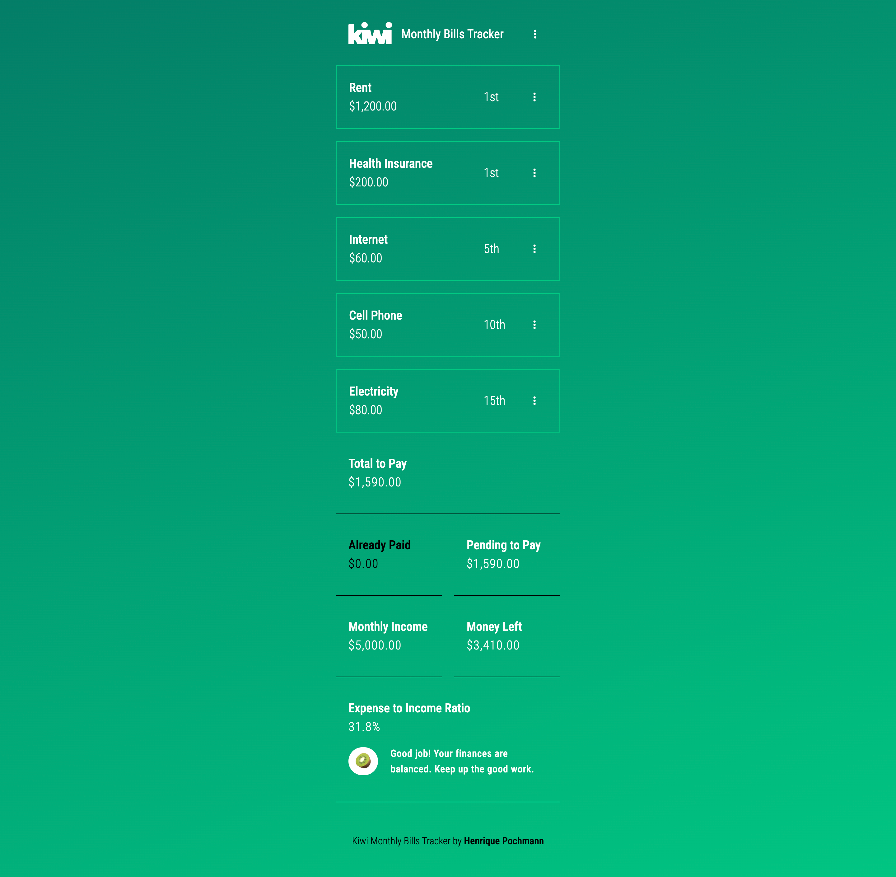

# Kiwi Monthly Bills Tracker | Web App

## Description

Kiwi is a simple way to track monthly bills. Its attractive design and casual tone make for an enjoyable and intuitive user experience.

Users can add their monthly bills and mark them as paid throughout the month. At the beginning of each month, the bills can be unmarked to restart the cycle.

Additionally, Kiwi displays a friendly message informing users whether they have a financial balance.

## Screenshot



## Installation and Usage

1.   Install Dependencies:
     ```sh
     npm i
     ```
2.   Run Vite:

     ```sh
     npm run dev
     ```

3.   Completion:
     -    You should now be all set to use the project.

## Features

-    **Responsive Design**: Ensures optimal viewing experience across a wide range of devices, from mobile phones to desktop computers.

## Technologies

-    Vite
-    React
-    TypeScript
-    Styled Components
-    Redux
-    React-Toastify
-    Jest
-    Babel
-    Font Awesome
-    ESLint
-    GitHub Actions (CI/CD pipeline)

## License

This project is licensed under the [MIT License](LICENSE.md).

## Credits

Created by Henrique Pochmann.

## Contact

You can reach out to me via [LinkedIn](https://www.linkedin.com/in/henriquepcm/) or henriquepcm@gmail.com.

```

```
